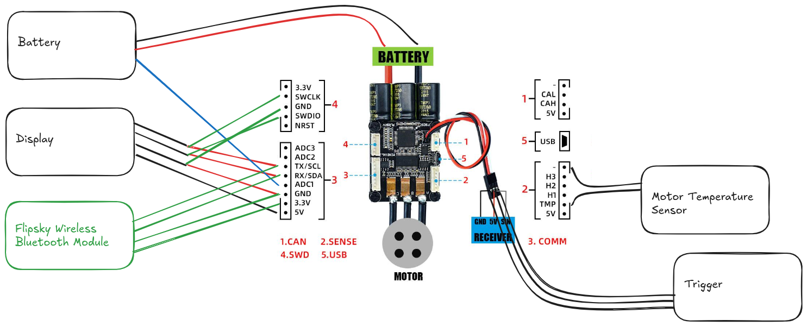

# Upgrading a Second Generation Dive Xtras Blacktip to Bluetooth Capability

## Prerequisites

- **Flipsky wireless Bluetooth module** (like [Flipsky Wireless Bluetooth Module 2.4G for VESC&VESC Tool Electric Skateboard for V6](https://www.aliexpress.com/item/1005008747516291.html))
- **VESC Tool** from [VESC Project](https://vesc-project.com/vesc_tool)
- the **'blacktip_dpv.vescpackage'** firmware from [GitHub](https://github.com/mikeller/vesc_pkg/releases/)

## Installation

1. **Remove the batteries**;
2. Disassemble the scooter and remove screws for the motor driver board above the motor, lift out the board (it does not have to be completely disconnected);
3. After this modification, the Bluetooth module connector will be on the socket where the Display is connected now, and the display connector will be on the 'SWD' connector next to it. So start by disconnecting the display connector from the '**Comm**' socket on the VESC. The rest of the connectors can stay in place;
4. Remove the **blue battery balance wire** from the display connector. Do this by using a pin or needle to lift the little tab on the connector, then gently pull out the wire and connector. Insert the blue wire's connector into the '**ADC1**' slot on the Bluetooth module connector. You will find that all the required slots on this connector are free;
5. Remove the '**5V**' wire from the display connector, and insert it into the '**5V**' slot on the Bluetooth module connector. On my display connector, all the wires except for the blue battery balance wire are black - if this is the case for you as well, move one wire at a time, and make extra sure you get the right one, or you will end up playing a game of 'guess the wire';
6. The Bluetooth module connector is now ready, plug it into the '**Comm**' socket;
7. On the display connector, remove the wire from the '**TX/SCL**' slot and insert it into the '**SWCLK**' slot;
8. On the display connector, remove the wire from the '**RX/SDA**' slot and insert it into the '**SWDIO**' slot;
9. You will have to shorten the display connector to make it fit into the 'SWD' slot. Use a craft knife to cut off the last two slots at the top of the connector. Make sure you don't accidentally cut a wire. When you are done, there should be one free slot to each side of the wires. Insert the display module connector into the '**SWD**' socket;
10. Use double sided tape to tape the bluetooth module to the middle of the VESC, and route the antenna out through the battery connector slot in the base plate;
11. Make sure the battery connector is plugged in. Plug a USB cable into the VESC and connect it to the computer running the VESC tool. Insert the batteries. The VESC should be recognised by the tool.
12. Follow the [instructions](./README.md#installation) to update the VESC firmware and install the 'blacktip\_dpv.vescpkg' VESC Package;
13. Remove the battery and reinsert. When connecting again the VESC tool will ask you to confirm running a custom package. Once confirmed, the Dive Xtras app will show up on the right side of the Welcome & Wizards tab. Go to 'Scooter Hardware Configuration', select '**Blacktip HW:60_MK5 with Bluetooth (Latest)**' in the drop-down, then click 'Save'. The scooter will reboot;
14. You should now be able to connect to the scooter via Bluetooth. Remove the USB cable, and click 'Scan', 'Scan BLE' in the Welcome & Wizards tab;
15. Carefully place the motor controller board back into its slot, making sure that you don't pinch any wires in the process. This is a bit fiddly as there is almost no space in the compartment. Replace the screws;
16. **Have fun with all the new functionality!**
