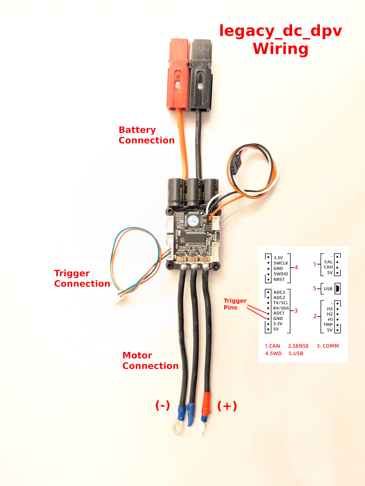

# Legacy DC DPV VESC Package

This add-on to Vedder's VESC motor control software is designed for older scuba Dive Propulsion Vehicles that have brushed DC motors and reed switch triggers.

It incorporates the following features

- **Double-click start:** means no more accidental starts.
- **Speed Control:** Instead of a single speed, this package allows for up to 8 user-defined speeds. Click twice to speed up and once to speed down.
- **Soft Start:** When starting the DPV, speed ramps up slowly so there is less impact on your crotch strap.
- **Start Speed:** Select which speed you want to start scooting at. 
- **Variable Battery Voltage:** If you are replacing your old battery with a new chemistry, you can optimise the size of the battery pack by adding more cells even if it increases overall voltage. By changing the user-defined speeds you can ensure that the motor won't go over-voltage.

## Hardware Requirements

- A legacy DPV like a Silent Submerge, Gavin, Hollis H-160 or a similar type that has a DC motor and reed switch trigger.
- A VESC compatible motor controller with suitable voltage and amperage capability. For example a Flipsky Mini6.7.
- A computer or a phone or laptop with a USB A adapter to program the hardware.
- Something to use as an enclosure for the controller board. This could be as simple as a plastic box 5cm x 8cm x 3m inside dimensions with zip ties to connect it to something inside the DPV.

## Skills Required

- You will need to strip and connect wires which may require soldering or crimping connectors.
- The ability to fashion a suitable enclosure for the hardware. This may require cutting, drilling or gluing.
- Basic computer skills.
- Basic electrical understanding.

## Tools Required

- wire cutters, possibly crimpers, and/or a soldering iron.
- An electrical multi-meter would be handy to verify the voltages being sent to the DPV motor before connecting it. It is also handy to check battery voltage and wire continuity.
- Basic tools, like screwdrivers, hex wrenches, wrench or nut driver... what ever is needed to disconnect and reconnect wires in your DPV.

## Software Required

- VESC-Tool is required to configure the VESC controller and load the **Legacy DC DPV** package. This is free software available from (https://vesc-project.com/vesc_tool)
- **Legacy DC EPV** VESC Package (this one.)

## Overview

### Physical connection

The conversion process involves disconnecting the original control hardware. For a Silent Submerge or Gavin that hardware is an electric relay located on top of the motor under a clear shield. For a H-160, it's a motor control PCB also located on top of the motor, under a T-brace and clear shield. These need to be removed to expose the motor terminals. Locate the reed switch wires and prepare them to connect to the new controller.

Connect the two outside motor wires from the VESC controller to the DPV motor terminals. Cover the middle VESC controller motor wire with a cap or tape to ensure it doesn't short out.

Connect the reed switch wires to the VESC controller, one wire goes to the pin labelled GND and the other goes to the pin labelled ADC1.

Connect the battery to the battery wires on the VESC controller, with positive going to the red wire and negative going to the black wire. It's best to use a connector, like a Anderson Powerpole or XT connector, so you can disconnect it as needed.

Once the VESC controller is connected to the motor, battery, and reed switch you need to program it. To program it connect a USB cable from your PC to the VESC controller and run **vesc-tool* on your PC.

### Connecting to the VESC Controller

Connecting should be easy. Connect the USB cable from the PC to the VESC controller and connect the VESC controller to the DPV battery.

In **vesc-tool** select **Connection** from the menu on the left.
The port should be auto-detected and already displayed. If not see if it is listed in the drop-down.
Click **Autoconnect** at the bottom.

### Update the firmware

We should use this time to ensure the most recent VESC firmware is installed on the VESC hardware.

To update VESC firmware:

In **vesc-tool** select **Firmware** from the menu on the left.
Click the **Download Latest** near the top-right of the window. This will take a minute or two.
Choose a suitable hardware option from the **Hardware Version** list.
Then choose the firmware listed on the right (probably **VESC_default.bin**),
At the lower right of the window, locate the down-arrow symbol button . If you hover your mouse over it will show *Update firmware on the connected VESC*. Click this button.
Allow the process to complete, about a minute or two, and ensure the VESC controller stays powered the entire time. Unplugging it could brick the device.
After a couple of minutes, attempt to re-connect.

### Install the Legacy DC DPV package

We must now install the **Legacy DC DPV*  package on the VESC controller.

To install it:

Ensure you are connected to the VESC controller as described in previous sections,
Select **VESC Packages** from the menu on the left,
Select the **Load Custom** tab near the top of the window,
Click the file folder icon  to the right of the **Load Package** field and use the file dialog to locate the downloaded package file.
Click the **Install** icon  beside the file folder icon.

This will only take a few seconds to complete.

### Configure VESC Settings

Several VESC controller settings need to be modified to suit your DPV.

While connected in the **vesc-tool**, modify settings by:

Select the **General** menu option under the **Motor Settings** menu on the left of the window.
Select the **General** tab along the top.
Set **Motor Type** to *DC*,
Select the **Current** tab along the top,
Set **Battery Current Max** to 30A
Select the **BMS** tab along the top,
Set **BMS Type** to *None*
Select the **Voltage** tab along the top,
Set **Battery Voltage Cutoff Start** and **Battery Voltage Cutoff End** to something suitable for your battery. This table may help.
| Battery Chemistry  | Voltage Cutoff Start  | Voltage Cutoff End  |
| Sealed Lead Acid (24V)  |  11.8 |  11.5 |
| Lithium-Ion (25.6V)  |  23.8 |  21.7 |
| Lithium-Iron (25.6V)  |  20 |  19.2 |
Select the **Advanced** tab along the top,
Set **Maximum Duty Cycle** to 100 %
Set the **Minimum Current** to 1A

Select the **Additional Info** menu option under the **Motor Settings** at the left of the window.
Set **Battery Type* to something suitable, there are options for Lithium-Ion, Lithium-Iron and Lead Acid.
Set **Battery Cell Series** to something suitable. For a 24V Lead acid (common among legacy DPVs) enter *12*. If you have a Li-Ion pack, it's probably *7*. If it's a LiFePO4 (Lithium-Iron) it's probably *8*.
Set **Battery Capacity** to what your battery is rated for, or a little less if it has been well used.

Select the **General** menu option under the **Application Settings** menu on the left of the window.
Set **Appto Use** to *None*

Now we need to save these settings to the VESC controller, to do that:

Locate the icon at the far right of the window that has a down-arrow and an 'M' . If you hover the mouse over this it will say **Write Motor Configuration**, click this icon.
Locate the icon at the far right of the window that has a down-arrow and an 'A' . If you hover the mouse over this it will say **Write app Configuration**=, click this icon.

